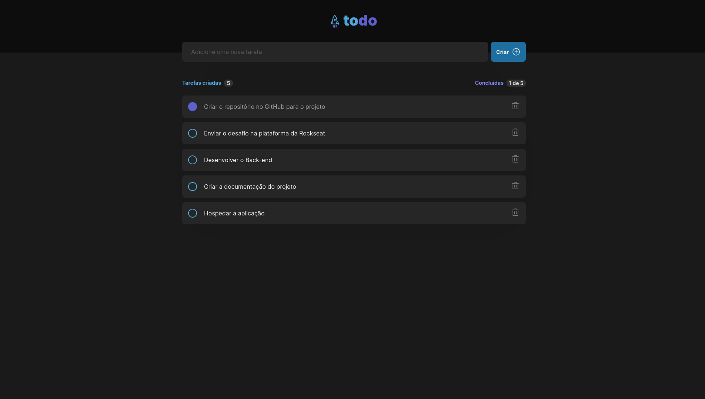

<h1 align="center">
    
</h1>

# Desafio 01 - Praticando os conceitos do ReactJS

Esse desafio consiste em desenvolver uma aplicação de controle de tarefas no estilo TO-DO LIST

## Funcionalidades

- Adicionar uma nova tarefa
- Marcar e desmarcar uma tarefa como concluída
- Remover uma tarefa da listagem
- Mostrar o progresso de conclusão das tarefas

## Stack utilizada

- [React.JS](https://pt-br.reactjs.org/)
- [Vite](https://vitejs.dev/guide/#trying-vite-online)

## Conhecimentos necessários

- Estados
- Imutabilidade do estado
- Listas e chaves no ReactJS
- Propriedades
- Componentização
## Rodando localmente

Clone o projeto

```bash
  git clone https://github.com/diego64/desafio_01_reactjs
```

Entre no diretório do projeto

```bash
  cd desafio_01_reactjs
```

Instale as dependências

```bash
  npm install
```

Inicie o servidor

```bash
  npm run dev
```